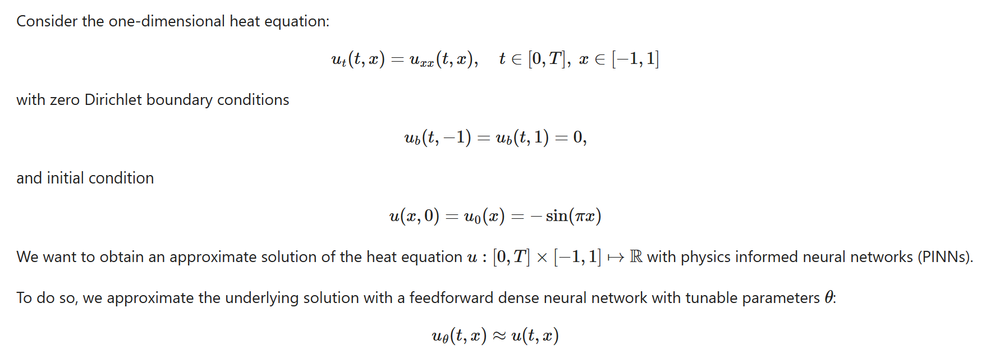

# PINNs
My PINNs excersises, practices, learning, training...

01 - Intro To PINNs -> Train the one-dimensional heat equation

02 - Using the Damped Harmonic Oscilator:
https://beltoforion.de/en/harmonic_oscillator/

Original code:
https://github.com/benmoseley/harmonic-oscillator-pinn/blob/main/Harmonic%20oscillator%20PINN.ipynb

Train a NN only with data and train it with the calculated loss: data + equation

